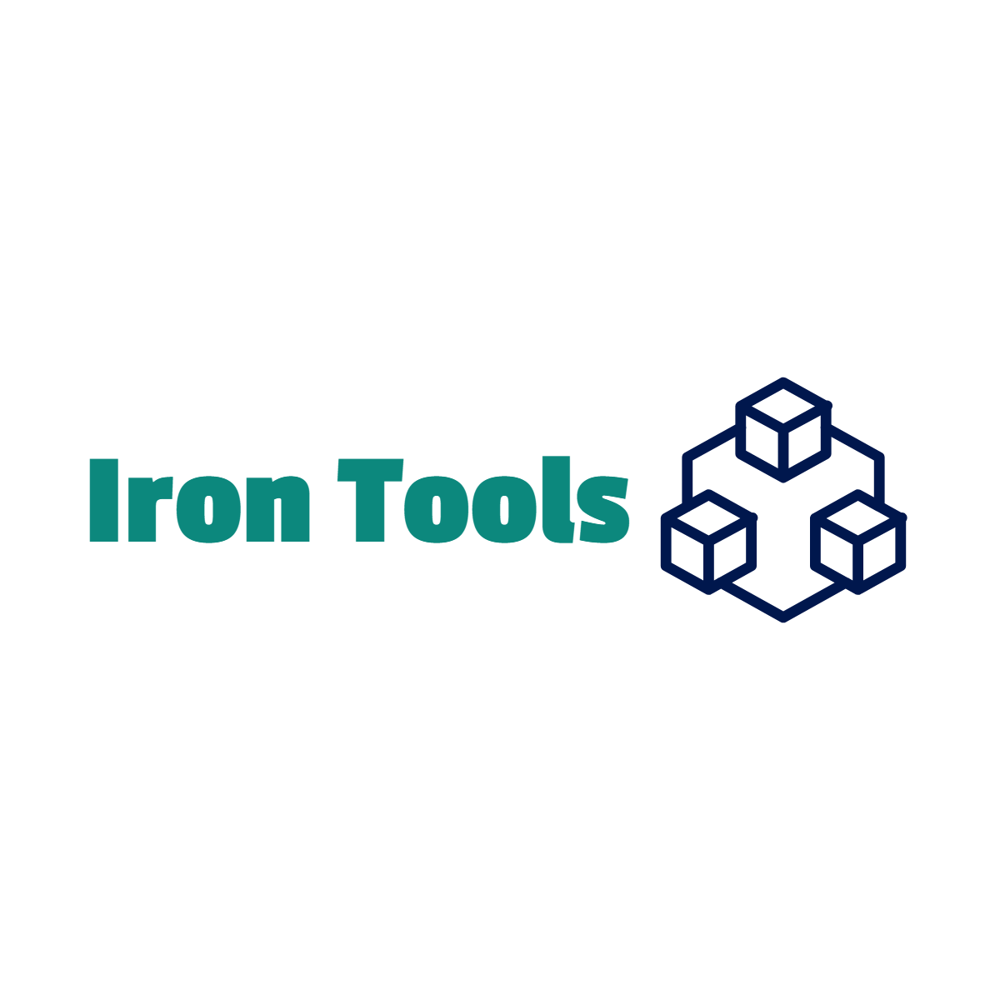

# Iron Tools Tutorial 🎮

A Unity project demonstrating how to use **Odin Inspector** to create custom editor tools.  
This repository is intended both for learning purposes and future reusability in other projects.

## 🎯 Purpose
✨ Extend and customize the Unity Editor using Odin Inspector and Iron Tools

⚙️ Build modular and scalable attributes like [ShowIf], [Button], [Section], [ShowTitle], and more

🎨 Design visually enhanced inspectors with dynamic layout and color themes

🚀 Create faster, smarter development workflows using interactive editor elements

🧩 Develop reusable and expandable editor frameworks for professional Unity projects

🧠 Explore conditional rendering, runtime method triggers, and visual structuring via IronTools architecture

## 🛠 Technologies Used

- Unity 2022.3 or higher  

## 🚀 How to Use

1. Make sure Iron Tools is installed in your project.  
2. Clone or download this repository.  
3. Drag any of the example scripts to a GameObject in your scene.  
4. Observe the custom editor interface created by Iron Tools in the Inspector window.

## 📚 Features (In Progress)
✅ Boolean fields with [ShowIf], [EnableIf], and conditional visibility attributes

🕒 Timed booleans and delayed actions using custom editor logic

🧩 Enum-based UI behaviors integrated with FoldoutGroup and Section styling

📂 Foldout groups and divider-based layouts with [FoldoutGroup], [ShowDivider]

🧠 ScriptableObject-powered editor tools for modular data control

🎛️ Visual Inspector themes with centralized style via EditorColorPalette

🎮 Interactive Inspector buttons with [Button], optional icons and method binding

⚙️ Inline editors and nested object drawers (upcoming InlineEditorAttribute)

📊 Visual data representation via custom GUIStyles and layout resolvers

## 🤝 Contributing

Youtube:[https://www.youtube.com/@issoeEnt/videos]

This is an open-source learning project.  
Feel free to contribute via pull requests, issues, or sharing your own custom Odin tools.

---

**Created by:** Muhammed Demir  
🔗 LinkedIn: [linkedin.com/in/muhammeddemir17](https://www.linkedin.com/in/muhammeddemir17)
